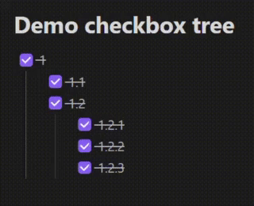
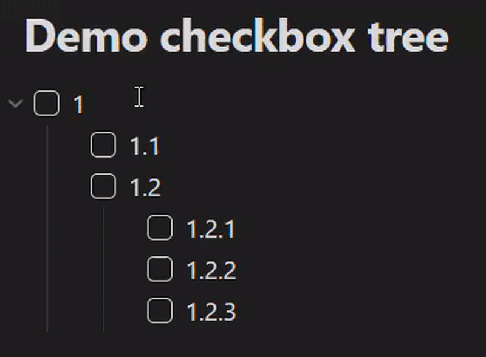

# Usage and Examples

- [English](#english)
- [Русский](#русский)

## English

After activating the plugin, it automatically tracks and synchronizes checkboxes based on your settings. You can enable or disable the upward sync (parent from children) and downward sync (children from parent) independently via the settings to tailor the behavior to your preferred workflow.

**Example 1: Parent state updates from children**
*(Requires `enableAutomaticParentState` setting)*

*Checking the last child causes the parent to become checked. Unchecking any child unchecks the parent.*

**Example 2: Child state updates from parent**
*(Requires `enableAutomaticChildState` setting)*

*Manually checking/unchecking the parent checkbox cascades the state change to all children.*

### Supported Lists

The plugin works with both ordered and unordered lists:
-   **Unordered Lists** - Lists created with `-`, `+` or `*` markers
-   **Ordered Lists** - Numbered lists (1., 2., etc.)

The plugin respects list indentation, allowing for nested checkbox hierarchies at any level. It also attempts to handle checkboxes within embedded files (`![[...]]`), though behavior might depend on Obsidian's own handling of embeds.

---

## Русский

После активации плагина, он автоматически отслеживает и синхронизирует чекбоксы в соответствии с вашими настройками. Вы можете независимо включать или отключать синхронизацию вверх (родитель от детей) и вниз (дети от родителя) с помощью настроек, чтобы адаптировать поведение под ваш рабочий процесс.

**Пример 1: Состояние родителя обновляется от детей**
*(Требует включенной настройки `enableAutomaticParentState`)*

*Отметка последнего дочернего чекбокса приводит к отметке родительского. Снятие отметки с любого дочернего элемента снимает отметку с родительского.*

**Пример 2: Состояние детей обновляется от родителя**
*(Требует включенной настройки `enableAutomaticChildState`)*

*Ручная отметка/снятие отметки с родительского чекбокса каскадно применяет изменение ко всем дочерним элементам.*

### Поддерживаемые списки

Плагин работает как с нумерованными, так и с ненумерованными списками:
-   **Ненумерованные списки** - Списки, созданные с помощью маркеров `-`, `+` или `*`
-   **Нумерованные списки** - Списки с цифровой нумерацией (1., 2. и т.д.)

Плагин учитывает отступы списков, позволяя создавать вложенные иерархии чекбоксов на любом уровне. Он также пытается корректно обрабатывать чекбоксы внутри встроенных файлов (`![[...]]`), хотя поведение может зависеть от собственной обработки встраиваний в Obsidian.